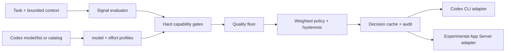

# Codex Smart Route

Automatic selection and application of a Codex **main model + reasoning effort** pair. Routing is local, observable, policy-driven, and independent from subagent orchestration.

> Alpha software. The `codex exec` adapter uses supported CLI flags. The App Server adapter follows a protocol generated from the installed Codex binary and remains experimental. No live model inference was run during initial validation.

## What it solves

Codex exposes model and reasoning choices with different capability, latency, and consumption tradeoffs. Smart Route discovers current choices, excludes incompatible profiles, estimates task fit, then minimizes a normalized weighted penalty. It applies result before execution.

It does not manage backlogs, schedule tasks, route subagents, modify `AGENTS.md`, or silently enable paid APIs. RTK, Caveman, and CaveCrew are neither dependencies nor integration points.



## Quick start

Windows PowerShell:

```powershell
py -3.11 -m venv .venv
.\.venv\Scripts\python -m pip install -e .
smart-route doctor
smart-route route --catalog examples/capabilities.example.json --task "Inspect this repository" --dry-run
```

macOS/Linux:

```bash
python3.11 -m venv .venv
.venv/bin/python -m pip install -e .
smart-route doctor
smart-route route --catalog examples/capabilities.example.json --task "Inspect this repository" --dry-run
```

Example catalog is fictional and exists only for offline demonstration. Normal `models` and `route` commands use Codex App Server `model/list`; unavailable fields remain `unknown` until configured as capability overrides.

## Real execution

```bash
smart-route exec --task "Fix the failing parser tests" --tools
```

CLI discovers profiles, routes, then launches:

```text
codex exec -m SELECTED_MODEL -c model_reasoning_effort="SELECTED_EFFORT" TASK
```

This preserves normal Codex authentication, streaming, tool loop, cancellation, and conversation behavior because Codex still owns execution. Running `exec` can consume account quota. Dry runs and standard tests make no model calls.

Experimental App Server integration patches `model` and `effort` on `turn/start` before forwarding JSONL traffic. It preserves other request fields and forwards notifications unchanged. See [Codex integration](docs/CODEX_INTEGRATION.md).

## Policies

- `economy`: stronger consumption preference, quality floor `0.60`.
- `balanced`: initial `0.50/0.30/0.10/0.10` weights, quality floor `0.70`.
- `quality`: stronger residual-quality preference, quality floor `0.82`.

Change future decisions with `smart-route policy economy|balanced|quality`. Custom policies live in `~/.codex-smart-route/config.toml`. Scores are operational estimates, not calibrated probabilities. Missing relative metrics use disclosed effort heuristics and make decision unverified.

## CLI

```text
smart-route doctor
smart-route models [--catalog FILE]
smart-route profiles [--catalog FILE]
smart-route route --task TEXT [--dry-run] [--json]
smart-route route --task-file FILE
smart-route exec --task TEXT
smart-route app-server --catalog FILE
smart-route explain
smart-route status
smart-route enable | disable
smart-route policy economy|balanced|quality
smart-route override [MODEL@EFFORT]
smart-route reevaluate
smart-route config validate | show
smart-route cache clear
smart-route logs
smart-route install-skill | uninstall-skill
```

JSON output is stable enough for automation within `0.1.x`. Exit codes: `0` success/selection, `2` no eligible route, `1` configuration/runtime error.

## Auto mode and evidence

Virtual entry is `Auto (Smart Route)`, slug `codex-smart-route`. It is replaced before forwarding and hard-excluded from candidate and classifier profiles.

- `selected`: routing result.
- `requested`: entry requested by caller, usually virtual Auto.
- `forwarded`: concrete model sent by adapter.
- `confirmed`: model reported by runtime/upstream metadata; `unverified` when absent.

Selection or payload inspection never counts as confirmation.

## Skill

```bash
smart-route install-skill --dry-run
smart-route install-skill
smart-route uninstall-skill
```

Installer touches only `~/.codex/skills/codex-smart-route`, records content integrity, refuses unmanaged overwrite, and removal refuses modified content. Package installation itself changes no Codex configuration.

## Offline behavior and optional classifier

Local deterministic rules are default. Remote JSON classification is disabled and never becomes fallback. It requires explicit endpoint and fixed non-Auto model configuration. Classifier sees bounded task context plus capability cards, never economic weights. Invalid, partial, oversized, or timed-out output fails visibly.

## Compatibility and limits

Python 3.11+; Windows, macOS, and Linux paths covered. Local audit used Codex CLI `0.153.4` on Windows. App Server schema exposed dynamic `model/list` and per-turn `model`/`effort`, but sandboxed runtime could not load its home directory, so live catalog and inference remain unverified. Desktop picker registration is not claimed. See [compatibility](docs/COMPATIBILITY.md) and [troubleshooting](docs/TROUBLESHOOTING.md).

## Uninstall

```bash
smart-route uninstall-skill
python -m pip uninstall codex-smart-route
```

Optionally remove `~/.codex-smart-route` after reviewing redacted audit and cache files.

## Contributing

Read [CONTRIBUTING.md](CONTRIBUTING.md), [architecture](docs/ARCHITECTURE.md), and [security policy](SECURITY.md). No benchmark or savings claim is accepted without reproducible task outcomes and total-consumption evidence.
